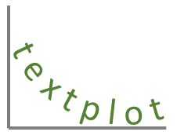
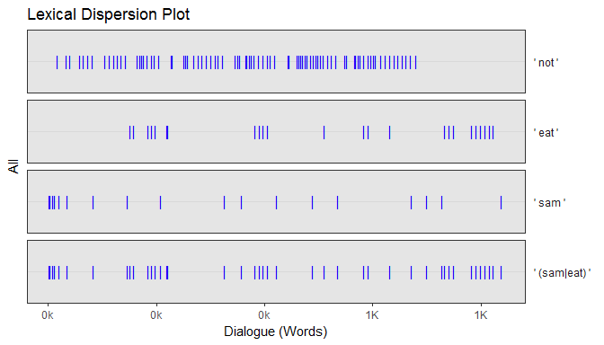
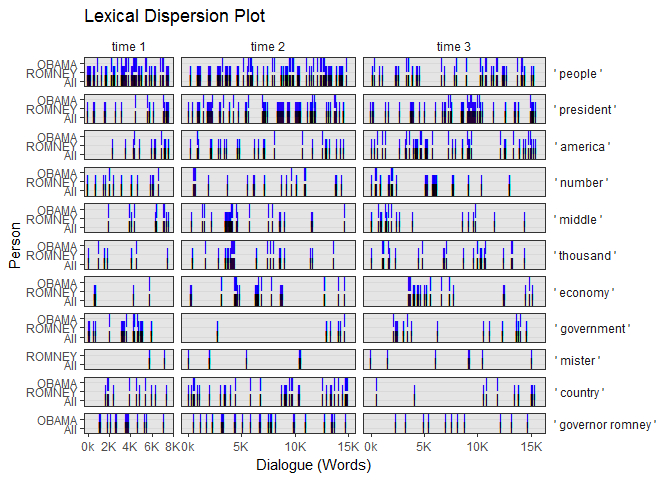
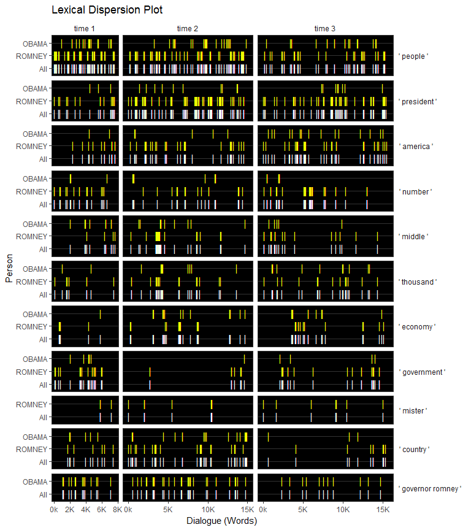
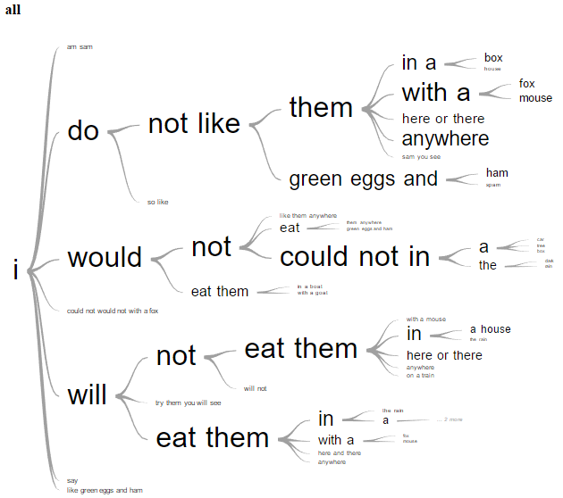
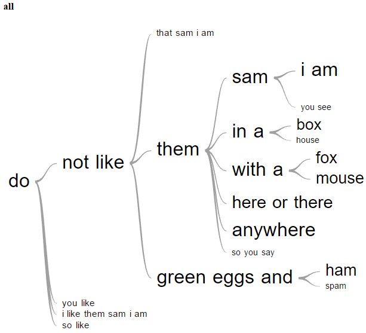
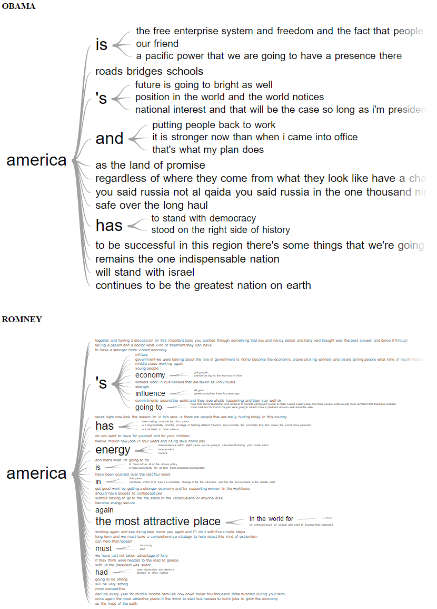
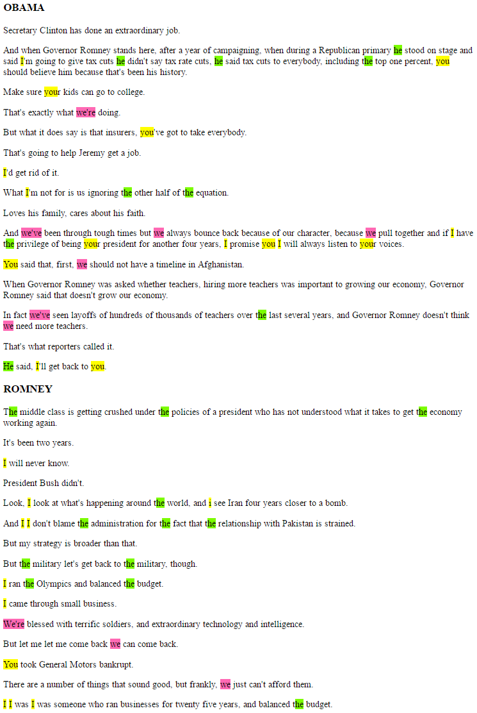
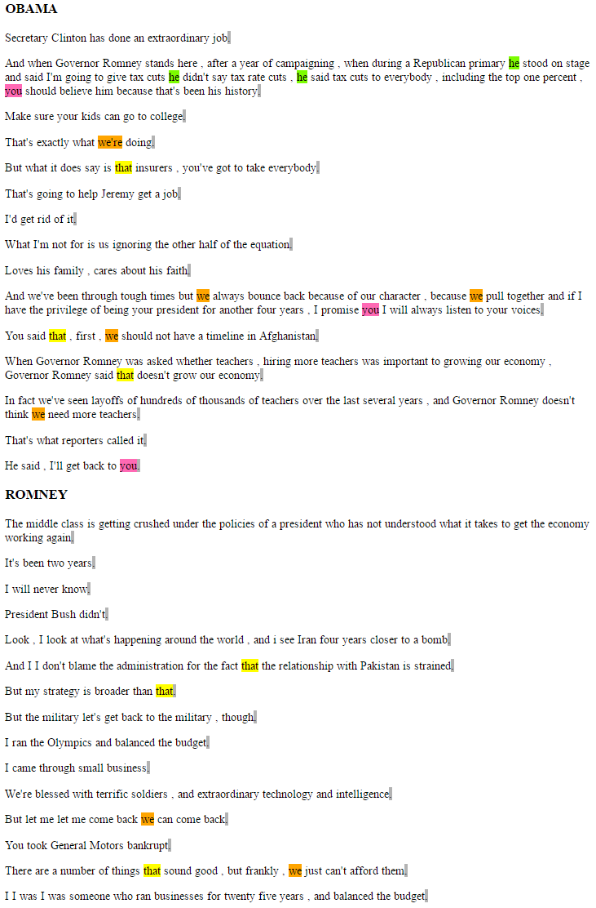
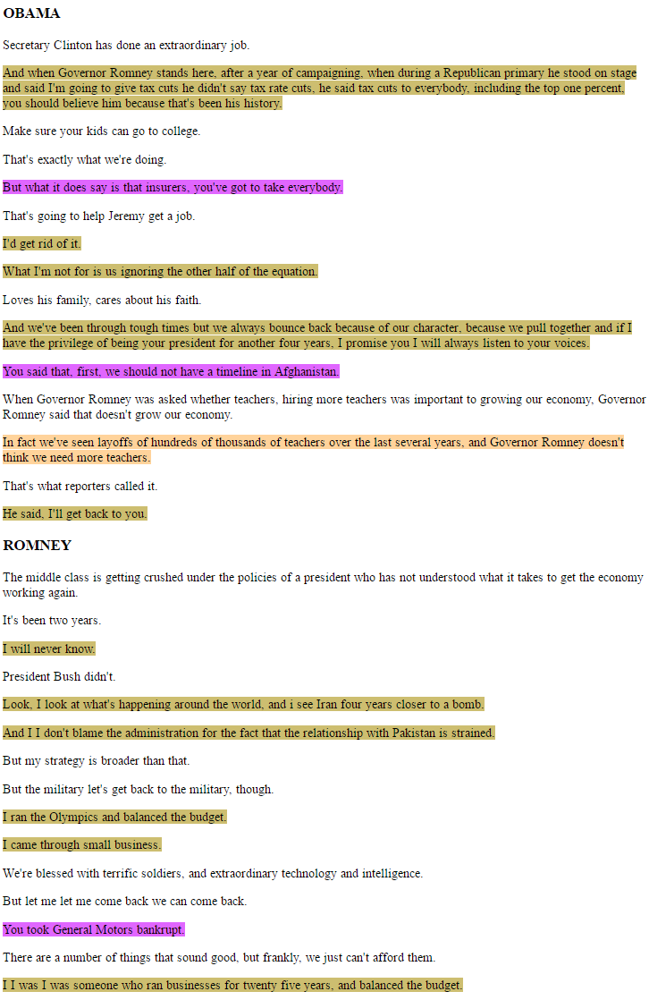

textplot   
============

**textplot** is a suite of text plotting tools that enable the user to
analyze text data via serveral common text plotting methods. Methods
include lexical dispersion plots, word trees, speech networks,
co-occurrence networks, speech Gantt charts, text hilighting, and word
clouds.

Table of Contents
============

-   [Functions](#functions)
-   [Installation](#installation)
-   [Examples](#examples)
    -   [Lexical Dispersion](#lexical-dispersion)
    -   [Word Trees](#word-trees)
    -   [Speech Networks](#speech-networks)
    -   [Co-occurrence Networks](#co-occurrence-networks)
    -   [Speech Gantt Charts](#speech-gantt-charts)
    -   [Text Hilighting](#text-hilighting)
        -   [Regular Expresion Terms](#regular-expresion-terms)
        -   [Token Matching](#token-matching)
        -   [Sentence Matching](#sentence-matching)
    -   [Word Clouds](#word-clouds)
-   [Contact](#contact)

Functions
============

Installation
============

To download the development version of **textplot**:

Download the [zip
ball](https://github.com/trinker/textplot/zipball/master) or [tar
ball](https://github.com/trinker/textplot/tarball/master), decompress
and run `R CMD INSTALL` on it, or use the **pacman** package to install
the development version:

    if (!require("pacman")) install.packages("pacman")
    pacman::p_load_current_gh("trinker/numform", "trinker/textplot")

Examples
========

    if (!require("pacman")) install.packages("pacman")
    pacman::p_load(dplyr, magrittr, textplot)

Lexical Dispersion
------------------

    sam_i_am %>%
        lexical_dispersion(c(' not ', ' eat ', ' sam ', ' (sam|eat) ')) %>%
        plot()

    pres_debates2012 %>%
        dplyr::filter(person %in% c('ROMNEY', 'OBAMA')) %$%
        lexical_dispersion(text.var = dialogue, term.list = wrds, 
            grouping.var = person, rm.var = time
        ) %>%
        plot()

    pres_debates2012 %>%
        dplyr::filter(person %in% c('ROMNEY', 'OBAMA')) %$%
        lexical_dispersion(text.var = dialogue, term.list = wrds, 
            grouping.var = person, rm.var = time
        ) %>%
        plot(, bg.color = "black", color = "red", 
            total.color = "white", horiz.color="grey20"
        )

Word Trees
----------

    word_tree(sam_i_am, word = 'I') %>%
        plot()

    word_tree(sam_i_am, word = 'do') %>%
        plot()

    presidential_debates_2012 %>%
        dplyr::filter(person %in% c('ROMNEY', 'OBAMA')) %$%
        word_tree(
            text.var = dialogue, 
            word = 'america', 
            grouping.var = person
        ) %>%
        plot()

Speech Networks
---------------

Co-occurrence Networks
----------------------

Speech Gantt Charts
-------------------

Text Hilighting
---------------

    hilighter_cols %>%
        view_cols()

### Regular Expresion Terms

    map1 <- list(
        `#FF69B4` = c('we(\'[a-z]+)?\\b'),
        `#7CFC00` = c('he(\'[a-z]+)?\\b'),
        yellow = 'you',
        gray70 = '\\bi(?=$|\\s)'
    )

    set.seed(10)
    presidential_debates_2012 %>%
        dplyr::filter(person %in% c('ROMNEY', 'OBAMA')) %>%
        dplyr::group_by(person) %>%
        dplyr::sample_n(15) %$%
        hilight_term(dialogue, map1, list(person)) %>%
        plot()

### Token Matching

    map2 <- list(
        `#FF69B4` = c('talk', 'you'),
        `#7CFC00` = c('he', "he's"),
        orange = c('we\'re', 'we'),
        yellow = 'that',
        gray70 = c('.', '?', '!')
    )

    set.seed(10)
    presidential_debates_2012 %>%
        dplyr::filter(person %in% c('ROMNEY', 'OBAMA')) %>%
        dplyr::group_by(person) %>%
        dplyr::sample_n(15) %$%
        hilight_token(dialogue, map2, list(person)) %>%
        plot()

### Sentence Matching

    map3 <- list(
        'think',
        c('he is', "he's", 'you(\'[vr]e)?\\b'),
        '\\bi\\b'
    ) %>%
        map_cols(rev(hilighter_cols))
        

    set.seed(10)
    presidential_debates_2012 %>%
        dplyr::filter(person %in% c('ROMNEY', 'OBAMA')) %>%
        dplyr::group_by(person) %>%
        dplyr::sample_n(15) %$%
        hilight_sentence(dialogue, map3, list(person)) %>%
        plot()

Word Clouds
-----------

Contact
=======

You are welcome to:    
- submit suggestions and bug-reports at: <https://github.com/trinker/textplot/issues>    
- send a pull request on: <https://github.com/trinker/textplot/>    
- compose a friendly e-mail to: <tyler.rinker@gmail.com>    
